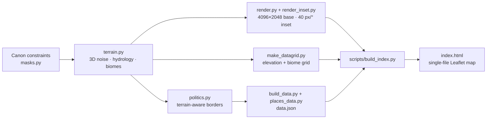

<div align="center">

# Master Map Rhykaris

*Two hemispheres. One scar. A world you can measure.*

<br>

[](https://rizkidwisulistianto-web.github.io/rhykaris-map/)


<br>


<sub>The whole planet in the viewer — physical layer, <b>The Scar</b>, and the AS 1647 territories. Interface and lore text are in Bahasa Indonesia.</sub>

<br>

[Overview](#overview) · [Features](#interactive-features) · [Quick start](#quick-start) · [How it's built](#how-its-built) · [Roadmap](#worldbuilding-progress--roadmap) · [Tech stack](#tech-stack--credits) · [License](#license)

</div>

<details>
<summary><b>🇮🇩 Ringkasan Bahasa Indonesia</b></summary>

<br>

**Master Map Rhykaris** adalah peta induk interaktif dunia fiksi **Rhykaris** (AS 1647): proyeksi equirectangular 4096 × 2048, The Scar, wilayah kuasa, dan status epistemik tiap koordinat (*Kanon · Turunan · Inferensi AI · Terbuka*). Semuanya ada dalam satu berkas `index.html` — unduh, klik dua kali, selesai. Peta butuh internet saat dibuka (Leaflet dan font dimuat dari CDN). Antarmuka dan teks lore berbahasa Indonesia.

**Status: work in progress.** Lapisan fisik (garis pantai, relief, sungai, bioma, batimetri, geometri Scar) sudah kanon di v4; lapisan politik masih snapshot AS 1647 dan akan terus bergeser. Kode: MIT. Konten dunia (data, peta, lore): CC BY-NC-ND 4.0.

</details>

---

## Overview

**Rhykaris** is an original fantasy world: a planet of two hemispheres — **Rhykar** and **Aëris** — joined along a global suture called **The Scar**. This repository is its *master map*: a single-file, fully interactive atlas of the world as it stands in **AS 1647**.

The map is **derived, not drawn.** The locked canon constraints — land/water proportions, one land corridor across the suture, the contact bay of *Sinus Adventus*, the antipode — are the *inputs* of a procedural generator (seed `1647`). Its physical layer (coastlines, relief, rivers, biomes, bathymetry) is then ratified as canon. On top of it sits a **political layer** — territories, borders, fronts — that is deliberately a *snapshot*, free to shift as the story moves.

### The map at a glance

| | |
|---|---|
| **Projection** | Equirectangular (plate carrée): longitude → x, latitude → y |
| **Base raster** | 4096 × 2048 px · 0.088°/px ≈ 12.7 km/px |
| **Detail inset** | Sinus Adventus at 40 px/° ≈ 3.6 km/px |
| **Planet** | radius 8,282 km (≈ 1.3 × Earth) · circumference 52,039 km |
| **Land / water** | 38 % land (Rhykar 23.0 % + Aëris 15.0 %) · 62 % water |
| **Seed** | `1647` — same seed and constraints, same planet |
| **Content** | 44 map entries · 3 anomaly pockets · 25 territories · 13 physical regions · 4 routes · 3 fronts |
| **Viewer** | Leaflet 1.9.4 · vanilla JavaScript · one self-contained 1.7 MB HTML file |

Because the planet is a sphere, the map **wraps seamlessly** across the antimeridian, and every distance is a **great-circle distance on the sphere** — never flat pixels.

### Every coordinate admits how sure it is

Each pin carries an *epistemic status* — the map separates what is locked from what is merely plausible:

| Chip | Meaning |
|---|---|
| **Kanon** · Canon | Locked by canon (the 0° meridian at the bay, the poles, the geometry of The Scar) |
| **Turunan** · Derived | Deterministically derived from canon + the generated coastline |
| **Inferensi AI** · AI inference | Placed by an AI assistant that obeys canon relations — provisional until the author locks it |
| **Terbuka** · Open | Deliberately left unlocked |

Marker rings encode the same thing at a glance: solid gold (canon), solid teal (derived), dashed amber (AI inference), dotted orange-red (open).

---

## Interactive Features

### Dynamic Markers & Popup Lore

- **44 entries** — **22 point markers** (capitals, cities, ports, a market city-state, fortresses, kingdoms, a tribe, a mine, a ruin, an oasis, two gates, a landmark, hidden sites) and **22 engraved labels** (continents, seas, regions, forests, a mountain range, an island group, an ice cap, a blank spot, The Scar and its four arcs) — plus **three mass-anomaly pockets**.
- **A glyph per place type**, a status ring per coordinate, an amber badge on *proposals* (places on the map that have no atlas entry yet), and a **collision-aware label placer** (capitals outrank cities, canon outranks inference) so the map stays legible at every zoom.
- **Honest uncertainty:** where a position is genuinely unknown (Castra Birath), the map draws a fading zone of concentric rings instead of a falsely precise dot.
- **Popups carry the lore:** aliases, type, canon and in-world status, the *reasoning* behind the coordinate, region and parent, hemisphere, strategic value and notes — plus, where the lore defines them, climate, population, hazards and controlling power. Each popup can copy its coordinates or start a measurement from that place.
- **Every place popup measures itself against The Scar:** angular distance to the curve (° and km), which side it lies on, and its class — *Within* (≤ 6.5°), *Adjacent* (≤ 19.5°), *Peripheral* (≤ 32.5°) or *Unaffected* — with a ✓ when the recorded canon value matches the computed one.
- **Deep links:** `index.html#litus_primum` opens straight onto a place.

### Faction Boundary / Territorial Layers

- **25 territories for AS 1647** — fifteen named powers (Hesperia, Foedera, Provincia Cassivallae, Aventalia, Tarvenna, Kloaka, the free city of Nundina, Liminara, Ktonia, Pylora, Anabasim, Emporys, Peratēs, Andurā, and Anušarri — drawn as the Mandala, below) plus three unnamed vassal commonwealths and seven illustrative Interregna kingdoms — toggled in groups from the **Layer** tab.
- **Terrain-aware borders:** frontiers are computed by a Dijkstra partition whose movement cost rises in mountains and along great rivers, grown from canon anchors — not hand-drawn polygons.
- **Hatching** marks contested, annexed and vassal land; **fronts** and expansion arrows show campaigns in motion.
- **The Mandala of Purity** (the Elvari empire, Anušarri) is drawn as a four-ring gradient with no border at all — power that radiates from its centre and thins out.
- Click any territory for its faction card.

### Search & Filter Panel

- **Instant, accent-insensitive search** across places, regions, factions and anomaly pockets — press <kbd>/</kbd> anywhere to jump in, <kbd>Enter</kbd> to fly to the first hit.
- **Filter by place type** (seven groups) and by **epistemic status**, including "proposals without an atlas entry". Filters and layer choices are remembered in your browser.

### More cartographer's instruments

| Instrument | What it does |
|---|---|
| **The Scar** | 13° band, small-circle curve, four arcs with proposed boundaries — Culmen Cicatricis, Latus Orientale, Ima Cicatricis, Latus Occidentale — and the anomaly pockets |
| **Three meridians** | 0° historic (Litus Primum), the official meridian (through Aurelia — proposed at ≈ 8.31° W, *AI-inferred* until ratified) and the Elvari meridian (180°, Libbāl) — switch the longitude frame in the readout |
| **Live readout** | Coordinates, distance and side to The Scar, plus elevation and biome for any point, read from a 1024 × 512 data grid |
| **Measure tool** | Great-circle distance between any two points, with rough travel times on foot, on horseback and by sailing ship |
| **Cartography layers** | 15° graticule · elevation contours (1,000 / 2,500 / 4,500 m) · bathymetry (−200 / −3,000 / −6,000 m) · six ocean banks · four kinds of route |
| **Audit tab** | The map's own consistency findings — frictions, blank spots, patterns, closed items — and the open *location debt* ledger |
| **Viewer comforts** | Dark / light theme · legend · scale bar · responsive layout with touch hints · respects *reduced motion* |

<table>
<tr>
<td width="50%" valign="top"><br><sub><b>Popup lore</b> — coordinates with reasoning, epistemic chip, Scar proximity.</sub></td>
<td width="50%" valign="top"><br><sub><b>Territorial layers</b> — grouped toggles and faction cards.</sub></td>
</tr>
<tr>
<td width="50%" valign="top"><br><sub><b>Audit tab</b> — the map keeps a public ledger of what it still owes.</sub></td>
<td width="50%" valign="top" align="center"><br><sub><b>Mobile</b> — bottom-sheet panel, touch measuring.</sub></td>
</tr>
</table>

| Key / gesture | Action |
|---|---|
| <kbd>/</kbd> | Focus search |
| <kbd>Enter</kbd> (in search) | Fly to the first result |
| <kbd>Esc</kbd> | Close popup · leave measure mode |
| Drag · scroll · pinch | Pan · zoom — the world wraps around |
| **Ukur** | Measure: tap two points (city icons work as start points) |

---

## Quick Start

The whole map is one file — no build step, no install.

**Option A — just open it**

1. Download this repo (**Code → Download ZIP**) or clone it:
   ```bash
   git clone https://github.com/rizkidwisulistianto-web/rhykaris-map.git
   ```
2. Double-click **`index.html`**.

**Option B — serve it locally** (VS Code *Live Server*, or any static server)

```bash
cd rhykaris-map
python3 -m http.server 8080      # then open http://localhost:8080
```

> **Needs an internet connection.** Leaflet is loaded from a CDN (cdnjs → unpkg → jsDelivr fallbacks) and the fonts from Google Fonts. If Leaflet cannot be fetched, the map says so instead of failing silently.

**Rebuild `index.html`** after editing anything in `app/`, `data/` or `assets/` (Python standard library only):

```bash
python3 scripts/build_index.py
```

---

## How it's built



- **Terrain** — 3D noise on the sphere (Perlin fBm + domain warp + ridged), thresholds calibrated per component with cos-latitude weighting, priority-flood + D8 hydrology, biomes from rainfall and temperature.
- **Map engine** — Leaflet with `L.CRS.Simple` extended by `wrapLng: [-180, 180]`, so latitude/longitude are plain map coordinates and the fictional planet pans seamlessly around the antimeridian (three world copies + `worldCopyJump`).
- **Rendering** — WebP image overlays for the physical layer, SVG for territories, regions, routes and The Scar, Canvas for graticule and contour lines.
- **Data** — everything the viewer knows lives in [`data/data.json`](data/data.json) and is inlined at build time.

<details>
<summary><b>Repository layout</b></summary>

```text
rhykaris-map/
├── index.html                 the whole map in one file (open me · GitHub Pages entry point)
├── app/                       viewer source: body.html · app.js · style.css
├── data/                      data.json (places, powers, audit …) · politics.json (territory geometry)
├── assets/                    physical layer 4096×2048 (PNG + WebP) · Sinus Adventus inset · terrain data grid · SVG preview
├── scripts/build_index.py     bundles app/ + data/ + assets/ into index.html
├── src/                       Python terrain & data pipeline (seed 1647)
├── vendor/leaflet/            Leaflet 1.9.4 stylesheet + license
├── docs/                      archive notes (canon status, measured values) + screenshots
├── LICENSE · LICENSE-CONTENT.md · THIRD_PARTY_NOTICES.md
└── README.md
```

</details>

<details>
<summary><b>Data reference</b> — <code>data/data.json</code></summary>

| Key | Contents |
|---|---|
| `places` | 44 entries: coordinates + reasoning, epistemic status + confidence, type, canon status, region, hemisphere, Scar class and distance, strategic value, notes — and, where defined, climate, population, hazards, controlling power |
| `anomalies` | 3 mass-anomaly pockets |
| `factions` | 26 powers: name, kind, colour, epistemic status, blurb |
| `territories` · `mandala` | Polygon rings for the 25 territories and the four Mandala rings |
| `regions` · `contours` · `banks` | Physical region outlines · 198 contour lines · six ocean banks |
| `routes` · `fronts` | 4 routes (historic, land, story, sea) · 3 fronts |
| `audit` · `ledger` · `unmapped` | 11 audit cards · 14 open location-debt slots · 11 entries deliberately left off the map |
| `stats` · `thresholds` | Measured land/water/hemisphere balance · Scar proximity thresholds |

`data/politics.json` holds the raw geometry of the political layer (territories, regions, mandala, contours). In this public edition, links from popups to the author's private worldbuilding vault were removed: every `url` field is `null`.

</details>

<details>
<summary><b>Regenerating the physical layer</b> (optional)</summary>

The Python pipeline in [`src/`](src/) needs Python 3.11 with `numpy`, `scipy`, `numba`, `Pillow` and `scikit-image`. Its scripts were written with absolute paths (`/home/claude/rhykaris_map/`) — mirror that folder or edit the paths. `terrain_4096.npz` (≈ 190 MB) is not stored here; step 1 regenerates it. Run order and details: [`docs/ARCHIVE_NOTES_v4.md`](docs/ARCHIVE_NOTES_v4.md).

| Step | Script | Produces |
|---|---|---|
| 1 | `terrain.py` | `terrain_4096.npz` |
| 2 | `calib_global.py` | `calib_4096.json` |
| 3 | `render.py` | `base_4096.png` → `base_q84.webp` |
| 4 | `render_inset.py` | `inset_40.png` + `inset_40_q84.webp` |
| 5 | `make_datagrid.py` | `datagrid.png` |
| 6 | `politics.py` | `politics.json` |
| 7 | `build_data.py` | `data.json` |
| 8 | `scripts/build_index.py` | `index.html` |
| 9 | `make_svg_preview.py` | `rhykaris_master_map_v4.svg` |

</details>

---

## Worldbuilding Progress / Roadmap

Rhykaris is **not finished — and the map says so.** This is a living status board, not a release schedule. Snapshot: **29 Sep 2026**, mirrored from the world's own development backlog.

| Area | Status | Notes |
|---|---|---|
| Physical layer — coast, relief, rivers, biomes, bathymetry, Scar geometry | ✅ Canon-stable · **v4** | Ratified 29 Sep 2026. Changes only through a new map version (v5 …) with a change-log entry — never silently |
| Scar Proximity rings | ✅ Ratified | Within ≤ 6.5° · Adjacent ≤ 19.5° · Peripheral ≤ 32.5° · Unaffected beyond. Polities are measured from the capital, physical regions from the centroid; a continent or ocean that crosses several rings gets no single value |
| Interactive viewer | ✅ **v1.4** · flat map | Search, filters, layers, measure tool, audit tab, mobile layout. A 3D globe is a parked wish — see *Later* below |
| Political layer — territories, borders, fronts | 🟡 Snapshot **AS 1647** | May grow and shift without touching the physical layer; individual Interregna kingdoms are added when the story needs them |
| Coordinates | 🟡 8 canon · 11 derived · 24 AI-inferred · 1 open *(of 44)* | Ratified entry by entry. The one open position (Castra Birath) is open **by design** — in-world, nobody knows exactly where it is |
| Proposals | 🟡 11 of 44 entries | On the map with a Draft atlas entry, but the position is not locked — flagged with an amber badge. Most of them sit in open ledger slots or backlog items |
| Atlas ↔ map v4 reconciliation | 🟠 In progress | Scar rings and the Zona Ambang Ellumāt settled on 29 Sep 2026; coordinates and the sea corridor are the next gates |
| Location-debt ledger | 🟠 14 open of 22 slots | Ports, market hubs, faction HQs, regional communities … tracked in the Audit tab |
| Audit findings | 🟠 8 awaiting a decision · 3 closed | 2 frictions · 3 blank spots · 3 patterns — see the Audit tab |

**Done**

- [x] Physical layer v4 ratified as canon (29 Sep 2026)
- [x] Viewer v1.4 — search · filters · layers · measure · audit · dark/light
- [x] 44 map entries · 25 territories · 4 routes · 3 fronts · 3 anomaly pockets
- [x] Scar Proximity rings ratified as canon (Within ≤ 6.5° · Adjacent ≤ 19.5° · Peripheral ≤ 32.5°)
- [x] Three audit items closed on 29 Sep 2026 — the Zona Ambang Ellumāt (now *Unaffected*), the position notes for Ellumāt, and the Dies Ignis Site's distance (it stays *Adjacent*, ≈ 2,640 km from the curve)
- [x] Public edition on GitHub, ready for GitHub Pages

**Next — reconcile the atlas with map v4**

In the author's order. 🔒 marks a gate: other work waits on it.

- [ ] 🔒 **Ratify coordinates for the macro atlas entries.** Only four carry coordinates so far (Sinus Adventus, Litus Primum, Vastitas, Corona Glacialis). The map proposes the rest, and each stays *AI-inferred* until the author confirms it. This includes the longitude of the official meridian (proposed through Aurelia at ≈ 8.31° W) and where the Zona Ambang Ellumāt point sits. Castra Birath is deliberately skipped.
- [ ] 🔒 **Ratify the main sea corridor of Tâmtu, the world ocean.** The sea route drawn on the map is a proposal. Several sea-facing ledger slots — trade waypoints, the neutral market hub, coastal communities — wait on it.
- [ ] **Mare Internum, the inland sea west of the gulf.** Its body of water became physical canon with v4; its name, its atlas entry and how Hesperia's north coast relates to it are still open. *(Closes one of the two open frictions.)*
- [ ] **Mass-anomaly pockets.** Three are mapped; up to two more are possible. Their positions wait on the coordinate pass, and the wider question is deliberately deferred (review due 31 Dec 2026).
- [ ] **Clean-up of pre-v4 atlas entries** — two of six sub-tasks done. Next: move the west boundary of Latus Occidentale to azimuth −166°, which can close the second open friction (the west end of Ima Cicatricis).

**Also open**

- [ ] **Close the 14 open location-debt slots** — ports (Portus, the main port of Peratēs), the neutral market hub Emporys, faction HQs, regional communities, religious sites …
- [ ] **The aquatic segment of The Scar** — about 62 % of the curve crosses sea. The ledger slot was unblocked on 29 Sep 2026; still to decide: an atlas entry of its own, or just an attribute of Tâmtu.
- [ ] **The trans-suture supercontinent** (≈ 7.6 % of the surface) — the largest landmass without a name or an atlas entry. Who lives there is a major lore decision; parked.
- [ ] **The ocean on the antimeridian side of the Rhykar cap** (≈ 9 %) — flagged by the audit; no sub-entry yet.
- [ ] **Extend the political layer** — more Interregna kingdoms and borders, when the story calls for them.

**Later — Interactive Map v2** *(parked wishlist — no commitment yet)*

The flat v1.4 viewer stays the baseline; stages are numbered as in the author's backlog.

- [ ] **Stage 2 — 3D globe:** relief, rotation, moons, compass, presets. Waits on the moon parameters.
- [ ] **Stage 3 — new layers:** hotspots, habitats, cover, day/night terminator, tides. Needs the coordinate pass, Stage 2 and an open consistency question about monster habitats.
- [ ] **Stage 4 — fine detail** for chosen regions (rivers, trees, smooth coastlines). Proposed first regions: Sinus Adventus, Hesperia, Ellumāt. Comes last, and fine detail does not become canon unless the author ratifies it.

Every new parameter — moons, axial tilt, tides, fine detail — stays *AI-inferred* until ratified.

**Known limitations**

- The viewer needs an internet connection (Leaflet and fonts come from CDNs).
- Interface and lore text are in Bahasa Indonesia; there is no English interface yet.
- The pipeline scripts in `src/` use absolute paths (see above).
- Coordinates marked *AI inference* are provisional by design.

---

## Tech Stack & Credits

| Layer | Technology |
|---|---|
| Map engine | [Leaflet](https://leafletjs.com/) 1.9.4 — `L.CRS.Simple` + `wrapLng` |
| Rendering | HTML5 · SVG (territories, regions, routes, Scar) · Canvas (graticule, contours) · WebP overlays |
| App | Vanilla JavaScript + CSS custom properties (dark/light) — no framework, no bundler |
| Data | JSON, inlined into a single-file build |
| Terrain pipeline | Python 3.11 · numpy · scipy · numba · Pillow · scikit-image |
| Typography | Cinzel · Cormorant Garamond · IBM Plex Sans & Mono (Google Fonts) |
| Hosting | GitHub Pages (static) |

**Credits**

- World, canon, cartography and design — **[@rizkidwisulistianto-web](https://github.com/rizkidwisulistianto-web)**
- [Leaflet](https://leafletjs.com/) © Volodymyr Agafonkin & contributors — BSD-2-Clause
- Fonts — Cinzel (The Cinzel Project Authors), Cormorant Garamond (The Cormorant Project Authors), IBM Plex (IBM Corp.) — SIL Open Font License 1.1

Full notices: [`THIRD_PARTY_NOTICES.md`](THIRD_PARTY_NOTICES.md).

---

## License

This repository carries two licenses of its own, split by what a file *is*:

| What | License |
|---|---|
| **Source code** — `app/`, `scripts/`, and the Python pipeline in `src/` | [MIT](LICENSE) |
| **World content** — `data/`, `assets/`, `docs/`, this README, the lore datasets `src/places_data.py` and `src/build_data.py`, and the map data, images and text embedded in `index.html` | [CC BY-NC-ND 4.0](LICENSE-CONTENT.md) — share with credit, non-commercial, no changes |
| **Third-party** — Leaflet, fonts | Their own licenses — see [`THIRD_PARTY_NOTICES.md`](THIRD_PARTY_NOTICES.md) |

Want to use Rhykaris beyond that — fan work, translation, a commercial project? Open an issue and ask.

<div align="center">
<br>
<sub>Made with too much cartography and not enough sleep.</sub>
</div>
