<div align="center">

# Master Map Rhykaris

*Two hemispheres. One scar. A world you can measure.*

<br>

[](https://rizkidwisulistianto-web.github.io/rhykaris-map/)


-000000?logo=threedotjs&logoColor=white)


<br>

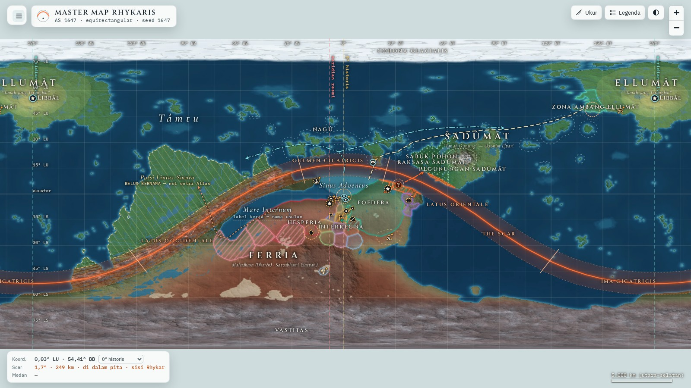

<sub>The whole planet in the viewer — physical layer, <b>The Scar</b>, and the AS 1647 territories. Interface and lore text are in Bahasa Indonesia.</sub>

<br>

[Overview](#overview) · [Features](#interactive-features) · [3D globe](#3d-globe-and-working-map-viewer-v15--v20) · [Quick start](#quick-start) · [How it's built](#how-its-built) · [Roadmap](#worldbuilding-progress--roadmap) · [Tech stack](#tech-stack--credits) · [License](#license)

</div>

<details>
<summary><b>🇮🇩 Ringkasan Bahasa Indonesia</b></summary>

<br>

**Master Map Rhykaris** adalah peta induk interaktif dunia fiksi **Rhykaris** (AS 1647): proyeksi equirectangular 4096 × 2048, The Scar, wilayah kuasa, dan status epistemik tiap koordinat (*Kanon · Turunan · Inferensi AI · Terbuka*). Semuanya ada dalam satu berkas `index.html` — unduh, klik dua kali, selesai. Sejak v1.5 peta bisa dipindah ke **globe 3D** (rotasi otomatis, dua bulan, kompas dengan jarum kedua ke The Scar, relief) dan ke **peta kerja dual-disk** (proyeksi Lambert equal-area, tanpa distorsi luas). Peta datar tetap menjadi dasar dan tidak berubah. Peta butuh internet saat dibuka (Leaflet dan font dimuat dari CDN; three.js hanya diunduh saat pengguna masuk ke 3D). Antarmuka dan teks lore berbahasa Indonesia.

**Parameter bulan, relief, dan semua angka baru di 3D bukan kanon**: bulan = *Inferensi AI*, relief = *Turunan* dari lapisan fisik v4. Kemiringan sumbu planet belum ditetapkan, jadi globe tidak menggambar musim, terminator, atau sisi malam.

**Status: work in progress.** Lapisan fisik (garis pantai, relief, sungai, bioma, batimetri, geometri Scar) sudah kanon di v4; lapisan politik masih snapshot AS 1647 dan akan terus bergeser. Kode: MIT. Konten dunia (data, peta, lore): CC BY-NC-ND 4.0.

</details>

---

## Overview

**Rhykaris** is an original fantasy world: a planet of two hemispheres — **Rhykar** and **Aëris** — joined along a global suture called **The Scar**. This repository is its *master map*: a single-file, fully interactive atlas of the world as it stands in **AS 1647**.

The map is **derived, not drawn.** The locked canon constraints — land/water proportions, one land corridor across the suture, the contact bay of *Sinus Adventus*, the antipode — are the *inputs* of a procedural generator (seed `1647`). Its physical layer (coastlines, relief, rivers, biomes, bathymetry) is then ratified as canon. On top of it sits a **political layer** — territories, borders, fronts — that is deliberately a *snapshot*, free to shift as the story moves.

### The map at a glance

| | |
|---|---|
| **Projection** | Equirectangular (plate carrée): longitude → x, latitude → y |
| **Base raster** | 4096 × 2048 px · 0.088°/px ≈ 12.7 km/px |
| **Detail inset** | Sinus Adventus at 40 px/° ≈ 3.6 km/px |
| **Planet** | radius 8,282 km (≈ 1.3 × Earth) · circumference 52,039 km |
| **Land / water** | 38 % land (Rhykar 23.0 % + Aëris 15.0 %) · 62 % water |
| **Seed** | `1647` — same seed and constraints, same planet |
| **Content** | 45 map entries · 3 anomaly pockets · 46 territories · 13 physical regions · 4 routes · 3 fronts |
| **Viewer** | Leaflet 1.9.4 · vanilla JavaScript · one self-contained ≈ 2 MB HTML file — plus, only when you enter 3D, three.js r160 and ≈ 9 MB of relief textures |

Because the planet is a sphere, the map **wraps seamlessly** across the antimeridian, and every distance is a **great-circle distance on the sphere** — never flat pixels.

### Every coordinate admits how sure it is

Each pin carries an *epistemic status* — the map separates what is locked from what is merely plausible:

| Chip | Meaning |
|---|---|
| **Kanon** · Canon | Locked by canon (the 0° meridian at the bay, the poles, the geometry of The Scar) |
| **Turunan** · Derived | Deterministically derived from canon + the generated coastline |
| **Inferensi AI** · AI inference | Placed by an AI assistant that obeys canon relations — provisional until the author locks it |
| **Terbuka** · Open | Deliberately left unlocked |

Marker rings encode the same thing at a glance: solid gold (canon), solid teal (derived), dashed amber (AI inference), dotted orange-red (open).

In the political layer a shape or number that the map chose for itself, because the vault has not decided it, carries an extra tag — *PLACEHOLDER, bukan kanon* or *usulan*. Those are never canon; they are drawn so that a feature can exist.

---

## Interactive Features

### Dynamic Markers & Popup Lore

- **45 entries** — **22 point markers** (capitals, cities, ports, a market city-state, fortresses, kingdoms, a tribe, a mine, a ruin, an oasis, two gates, a landmark, hidden sites) and **23 engraved labels** (the Imperial Commonwealth umbrella, continents, seas, regions, forests, a mountain range, an island group, an ice cap, a blank spot, The Scar and its four arcs) — plus **three mass-anomaly pockets**.
- **A glyph per place type**, a status ring per coordinate, an amber badge on *proposals* (places on the map that have no atlas entry yet), and a **collision-aware label placer** (capitals outrank cities, canon outranks inference) so the map stays legible at every zoom.
- **Honest uncertainty:** where a position is genuinely unknown (Castra Birath), the map draws a fading zone of concentric rings instead of a falsely precise dot.
- **Popups carry the lore:** aliases, type, canon and in-world status, the *reasoning* behind the coordinate, region and parent, hemisphere, strategic value and notes — plus, where the lore defines them, climate, population, hazards and controlling power. Each popup can copy its coordinates or start a measurement from that place.
- **Every place popup measures itself against The Scar:** angular distance to the curve (° and km), which side it lies on, and its class — *Within* (≤ 6.5°), *Adjacent* (≤ 19.5°), *Peripheral* (≤ 32.5°) or *Unaffected* — with a ✓ when the recorded canon value matches the computed one.
- **Deep links:** `index.html#litus_primum` opens straight onto a place.

### Faction Boundary / Territorial Layers

- **46 territories for AS 1647** — fifteen named powers (Hesperia, Foedera, Cassivalla, Aventalia, Tarvenna, Kloaka, the free city of Nundina, Liminara, Ktonia, Pylora, Anabasim, Emporys, Peratēs, Andurā, and Anušarri — drawn as the Mandala, below); the **Imperial Commonwealth** umbrella (Hesperia plus the *marka* belt, nominal jurisdiction, drawn beneath both; v1.8); a narrow belt of **kerajaan marka**, the Commonwealth's vassals on the edge of Hesperia's direct land; the **Satvan Pedalaman dispersal zone**; Hesperia's three optional province belts, Foedera's inhabited core and Kloaka's control zone (see below); and a mosaic of 23 illustrative **Interregna** polities — eleven kingdoms, six free cities, three tribal lands and three micro-polities, some of them enclaves (one nested two deep) and one with an exclave — each with a proposed name and a short lore card taken from the vault's Atlas drafts (*Inferensi AI*, not locked; the count and the borders stay open knobs), toggled in groups from the **Layer** tab. *(The three numbered "Vasal Commonwealth" polygons of earlier versions were retired in v1.7: they rested on a reading of Hesperia that is not canon.)*
- **A polygon says what is *claimed*, not what is *settled* (v1.7).** **Hesperia** is one polygon of nominal jurisdiction, not clipped; its about 50 provinces, in three belts by distance to the sea (Pesisir 24 · Transisi 19 · Pedalaman 7), are an **optional layer, off by default** — and no single province border is drawn. **Foedera** keeps its big polygon (control there is cheap: garrisons on the line) as light hatching, with a thin-populated core along the waterways on top. **Kloaka** has a thin dashed polygon for its nominal claim and a dotted zone with no hard edge for the control that shifts — its popup says *kerajaan nominal, tanpa penegakan*. The **Satvan Pedalaman** zone is a band of very low density in the southern interior: dots only, **no border line**, not a sovereign land. Everything in this paragraph that is not canon is labelled *usulan* / *Inferensi AI* in the viewer; details in [`docs/POLITICS_V3_NOTES.md`](docs/POLITICS_V3_NOTES.md).
- **One word, one rule (#214).** *Provinsi* is used only for land ruled directly by Hesperia; Commonwealth members are *kerajaan*; Cassivalla is named *Cassivalla* (*Provincia Cassivallae* appears only as a labelled Foedera exonym in its popup).
- **Terrain-aware borders:** frontiers are computed by a Dijkstra partition whose movement cost rises in mountains and along great rivers, grown from canon anchors — not hand-drawn polygons. The Interregna mosaic is redrawn by `src/interregna.py` from one table of seeds and sizes (`src/interregna_table.py`); see [`docs/INTERREGNA_V2_NOTES.md`](docs/INTERREGNA_V2_NOTES.md).
- **Hatching** marks contested, annexed, claimed and vassal land; **dots** mark a diffuse zone with no edge (Satvan Pedalaman, Kloaka's shifting control); **fronts** and expansion arrows show campaigns in motion.
- **The Mandala of Purity** (the Elvari empire, Anušarri) is drawn as a four-ring gradient with no border at all — power that radiates from its centre and thins out.
- Click any territory for its faction card.

### Search & Filter Panel

- **Instant, accent-insensitive search** across places, regions, factions and anomaly pockets — press <kbd>/</kbd> anywhere to jump in, <kbd>Enter</kbd> to fly to the first hit.
- **Filter by place type** (seven groups) and by **epistemic status**, including "proposals without an atlas entry". Filters and layer choices are remembered in your browser.

### 3D globe and working map (viewer v1.5 – v2.0)

A second view of the **same data**, behind one button (**Globe 3D**, next to the Ukur button; or open `index.html?view=3d`, optionally with a place such as `index.html?view=3d#litus_primum`). The flat map is the default for new visitors (the viewer remembers the last view you used) and is untouched: it never downloads three.js, and its pixels are identical to v1.4.

- **Real sphere, real texture.** The canon v4 raster is wrapped on a sphere. Drag to rotate (with inertia), scroll / pinch to zoom, double-click to fly to a point; arrow keys and <kbd>+</kbd> <kbd>−</kbd> work too. The planet **turns by itself** — slowly, west to east — and **stops the moment you touch it** (the *Putar* button in the dock and the panel's *Putaran planet* group bring it back; with a *reduce motion* system setting it stays off).
- **Every layer, both views.** All 29 layers of the flat map (the 25 of v1.4, plus the Hesperia belts and the Satvan zone of v1.7, and the Imperial Commonwealth umbrella and the Commonwealth kingdoms of v1.8) have a 3D counterpart (graticule, meridians, Scar band and curve, arcs, anomaly pockets, territories, routes, fronts, banks, markers…). Toggles are shared: switch a layer in 2D, it is on in 3D. The panel lists, per layer, whether it exists in the current view.
- **Two moons.** *Ferrea* (the big moon) and *Errans* (the small moon) orbit on Kepler ellipses, drawn **not to scale**: true relative radii (0.2415 : 0.0604), distances compressed monotonically (the label says *jarak tidak berskala*), orbit periods in the real ratio 3.41 : 1. Click a moon for its parameters. **All moon parameters are *Inferensi AI*, not canon** — and so are the names: *Ferrea* ("iron-bearing", from its dark iron-red grey) and *Errans* ("wandering", from its swaying orbit) are working names, the human exonyms, chosen on 1 Oct 2026; the names each race uses are still undecided. The small moon's mean distance stays ≤ 125,000 km (the stability cliff is ≈ 131,000 km); eccentricity and inclination ranges are shown as ranges, never animated.
- **Working compass.** A north needle and a **second needle that points to The Scar** (bearing and great-circle distance to the curve; it deliberately has no direction at the pole of the circle). Works in 2D, 3D and the disk view, from the point under the cursor or the centre of the view. Since v1.7.1 it can be **switched off** (the *Kompas* toggle in the toolbar; on phones in the panel header) or **minimized** to a small dial with no text (the button on the compass card), so it no longer has to cover the map; both choices are remembered per browser.
- **Relief (2b).** Heights from a **regenerated 16-bit heightmap** (checked against the canon data grid: 100 % of pixels identical), a slope map for per-pixel lighting, and an albedo texture **without baked-in hillshade**. A slider sets the **vertical exaggeration** (0–60×, default 15×; real relief is ≈ ±10 km on an 8,282 km radius — about 0.1 %, so the exaggeration is for legibility only and is labelled *tidak berskala*). Relief is *Turunan*.
- **Measure tool in every view (v1.6.1).** **Ukur** works on the flat map, the globe and the working map: tap two points (a marker is taken at its exact position, anywhere else the point under the finger) and the viewer draws the **great-circle line**, the two dots and a result box with the distance and rough travel times — the same wording as on the flat map. "Ukur dari sini" on a place card starts from that place without leaving the view, and a finished measurement follows you when you switch views. On the working map the line is drawn per disk, so it stops at a rim and continues on the other disk.
- **Honest 3D.** Each moon's label says *Inferensi AI · tidak berskala*, and the Globe panel states the open axial tilt; Castra Birath is still a fading zone, never a point; nothing on the globe predicts or schedules the Great Wave. The axis is drawn upright with a neutral, camera-attached light — there is **no terminator, night side or seasons** because the axial tilt is still *Terbuka*.
- **Dual-disk working map (optional).** A third view: the planet as two **Lambert azimuthal equal-area** disks — Rhykar and Aëris side by side, areas in true proportion (34.96 % : 65.04 %), centred on the Scar's pole of the circle. For measuring and layout work. Since v1.6.5 it carries **every layer of the flat map** — contours, physical regions, ocean banks, the ten territory groups and the Mandala, routes, fronts, place and water labels — plus the Scar layers, with the same hover tooltips and cards; only the four 3D-only layers (moons, orbits, axis, ecliptic) are absent. Since v1.7 all three views read one shared table for territory groups, drawing order and patterns, so a layer stacks and answers a click the same way on the flat map, the globe and the working map.

<table>
<tr>
<td width="50%" valign="top">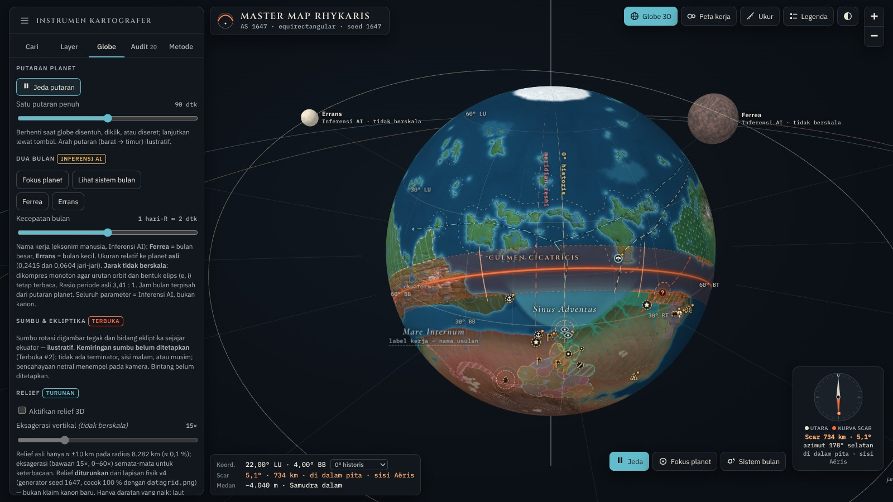<br><sub><b>Globe</b> — compass with the Scar needle, layer panel.</sub></td>
<td width="50%" valign="top">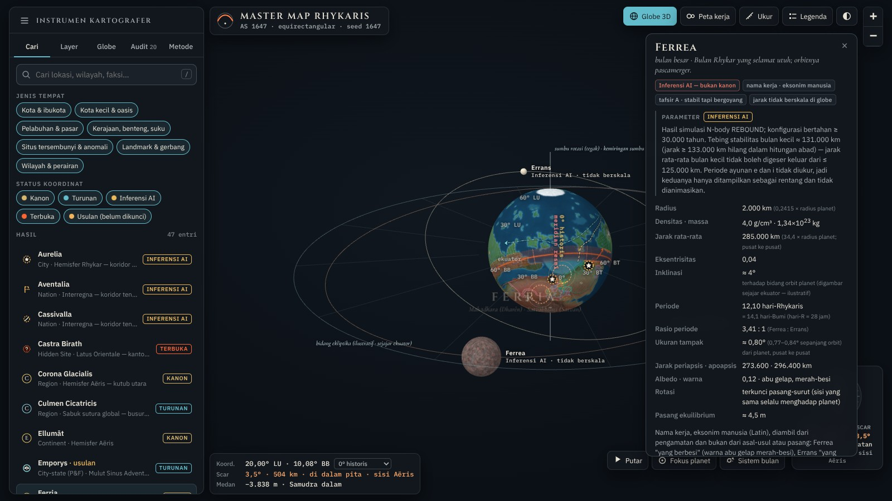<br><sub><b>Two moons</b> — true relative radii, compressed distances (<i>jarak tidak berskala</i>), Inferensi AI.</sub></td>
</tr>
<tr>
<td width="50%" valign="top">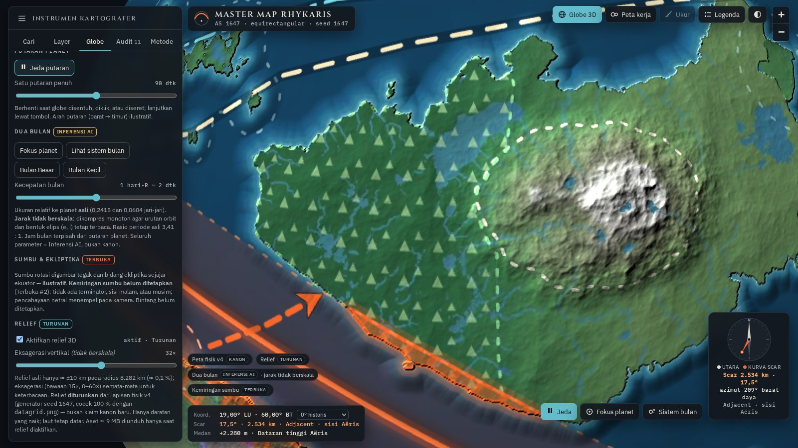<br><sub><b>Relief</b> — regenerated 16-bit heightmap, per-pixel lighting, exaggeration slider.</sub></td>
<td width="50%" valign="top">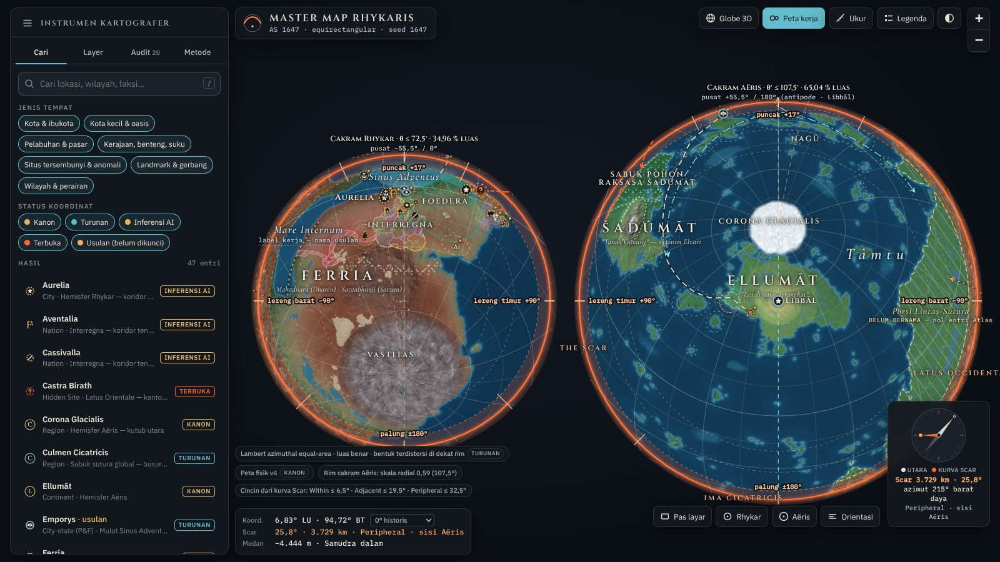<br><sub><b>Dual-disk</b> — Rhykar and Aëris in equal-area proportion.</sub></td>
</tr>
<tr>
<td colspan="2" align="center">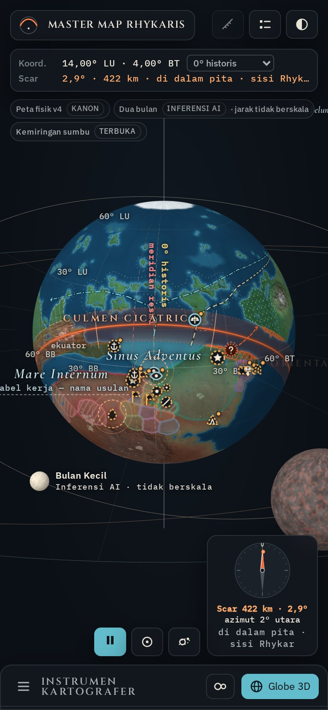<br><sub><b>Mobile</b> — the toggle lives in the panel header; one-finger rotate, pinch zoom.</sub></td>
</tr>
</table>

Design notes, every autonomous decision, the moon provenance and the regeneration steps: [`docs/STAGE2_NOTES.md`](docs/STAGE2_NOTES.md).

### More cartographer's instruments

| Instrument | What it does |
|---|---|
| **The Scar** | 13° band, small-circle curve, four arcs with proposed boundaries — Culmen Cicatricis, Latus Orientale, Ima Cicatricis, Latus Occidentale — and the anomaly pockets |
| **Three meridians** | 0° historic (Litus Primum), the official meridian (through Aurelia — proposed at ≈ 8.31° W, *AI-inferred* until ratified) and the Elvari meridian (180°, Libbāl) — switch the longitude frame in the readout |
| **Live readout** | Coordinates, distance and side to The Scar, plus elevation and biome for any point, read from a 1024 × 512 data grid |
| **Measure tool** | Great-circle distance between any two points, with rough travel times on foot, on horseback and by sailing ship |
| **Cartography layers** | 15° graticule · elevation contours (1,000 / 2,500 / 4,500 m) · bathymetry (−200 / −3,000 / −6,000 m) · six ocean banks · four kinds of route |
| **Audit tab** | The map's own consistency findings — frictions, blank spots, patterns, closed items — and the open *location debt* ledger. Since v1.7 it also carries the blank spots of the political layer (Satvan's legal status, the number and names of the Interregna, Hesperia's coast, Kloaka's position) |
| **Compass** | North needle + a second needle toward The Scar, with distance, in every view; can be switched off or minimized to a small dial (v1.7.1) |
| **Viewer comforts** | Dark / light theme · legend · scale bar · responsive layout with touch hints · respects *reduced motion* |

<table>
<tr>
<td width="50%" valign="top">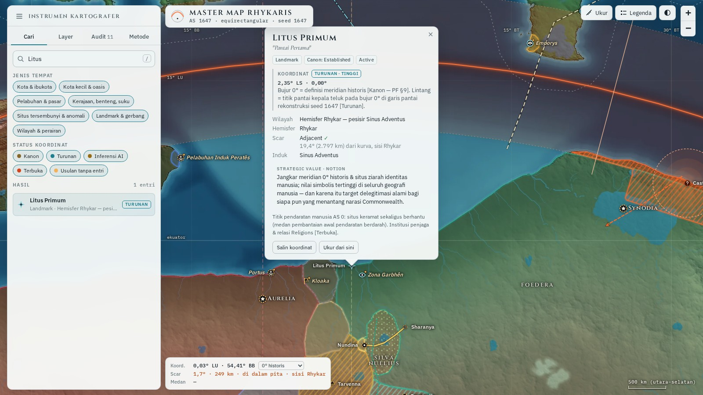<br><sub><b>Popup lore</b> — coordinates with reasoning, epistemic chip, Scar proximity.</sub></td>
<td width="50%" valign="top">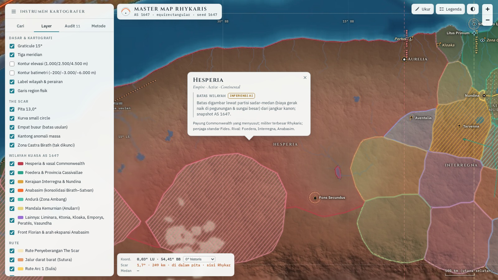<br><sub><b>Territorial layers</b> — grouped toggles and faction cards.</sub></td>
</tr>
<tr>
<td width="50%" valign="top">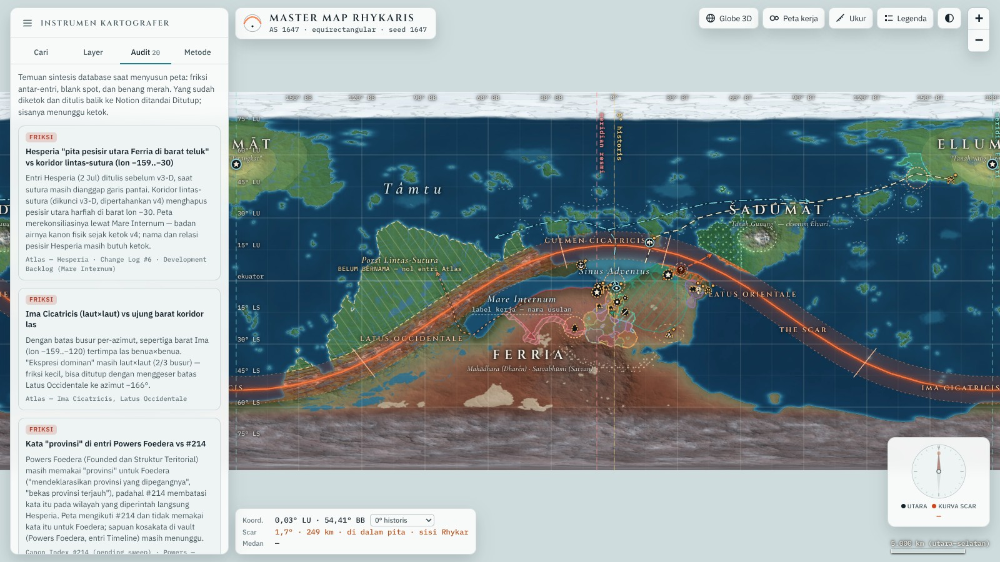<br><sub><b>Audit tab</b> — the map keeps a public ledger of what it still owes.</sub></td>
<td width="50%" valign="top" align="center">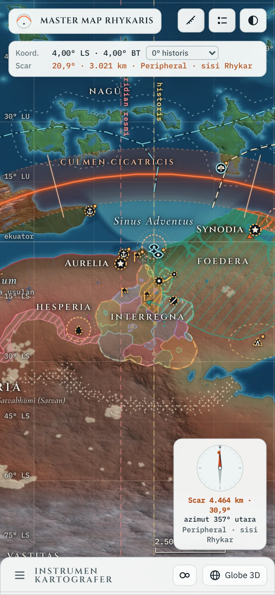<br><sub><b>Mobile</b> — bottom-sheet panel, touch measuring.</sub></td>
</tr>
</table>

| Key / gesture | Action |
|---|---|
| <kbd>/</kbd> | Focus search |
| <kbd>Enter</kbd> (in search) | Fly to the first result |
| <kbd>Esc</kbd> | Close popup · leave measure mode |
| Drag · scroll · pinch | Pan · zoom — the world wraps around (in 3D: rotate · zoom) |
| **Globe 3D** · **Peta kerja** | Switch to the 3D globe · to the dual-disk working map (press again to return to the flat map) |
| **Ukur** | Measure: tap two points (city icons work as start points) — flat map, globe and working map |

---

## Quick Start

The whole map is one file — no build step, no install.

**Option A — just open it**

1. Download this repo (**Code → Download ZIP**) or clone it:
   ```bash
   git clone https://github.com/rizkidwisulistianto-web/rhykaris-map.git
   ```
2. Double-click **`index.html`**.

**Option B — serve it locally** (VS Code *Live Server*, or any static server)

```bash
cd rhykaris-map
python3 -m http.server 8080      # then open http://localhost:8080
```

> **Needs an internet connection.** Leaflet is loaded from a CDN (cdnjs → unpkg → jsDelivr fallbacks) and the fonts from Google Fonts. If Leaflet cannot be fetched, the map says so instead of failing silently.
>
> **3D needs WebGL and `http(s)://`.** three.js r160 is downloaded only when you enter 3D (jsDelivr → cdnjs → unpkg → the vendored copy in `vendor/three/`, each integrity-checked) and the relief textures in `assets/3d/` are fetched relative to the page, so the 3D views work from GitHub Pages or a local server (Option B) but **not** by double-clicking `index.html` (`file://`). If 3D is unavailable the viewer says why and stays on the flat map.

**Rebuild `index.html`** after editing anything in `app/`, `data/` or `assets/` (Python standard library only):

```bash
python3 scripts/build_index.py
```

**Run the tests** (optional — Node 20+, headless Chromium via Playwright):

```bash
cd tests && npm install
node run-all.mjs                    # unit · political layer · 3D features · relief · dual-disk · accessibility · measure tool
RH_BASELINE=/path/to/baseline node run-all.mjs   # + pixel-identical 2D regression against a baseline captured on main
```

---

## How it's built

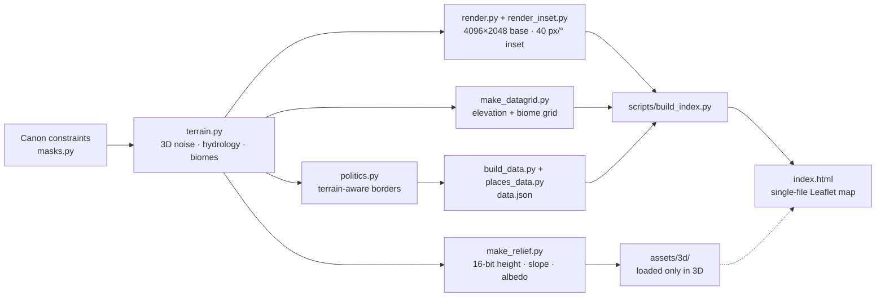

- **Terrain** — 3D noise on the sphere (Perlin fBm + domain warp + ridged), thresholds calibrated per component with cos-latitude weighting, priority-flood + D8 hydrology, biomes from rainfall and temperature.
- **Map engine** — Leaflet with `L.CRS.Simple` extended by `wrapLng: [-180, 180]`, so latitude/longitude are plain map coordinates and the fictional planet pans seamlessly around the antimeridian (three world copies + `worldCopyJump`).
- **Rendering** — WebP image overlays for the physical layer, SVG for territories, regions, routes and The Scar, Canvas for graticule and contour lines.
- **Data** — everything the viewer knows lives in [`data/data.json`](data/data.json) and is inlined at build time.
- **3D** — three.js r160, loaded lazily on first use (the 2D path never fetches it). A custom shader displaces the sphere from the packed 16-bit heightmap and lights it from a slope map; the globe, the disk view and the moons are separate lazily-evaluated modules (`app/globe/`, `app/disk.js`) that the build inlines as inert `text/plain` blocks, so the flat map pays nothing for them. All layers go through one registry with a per-view adapter (flat · globe · disk).

<details>
<summary><b>Repository layout</b></summary>

```text
rhykaris-map/
├── index.html                 the whole map in one file (open me · GitHub Pages entry point)
├── app/                       viewer source: body.html · app.js · style.css · core.js · moons.js · compass.js
│   ├── disk.js                dual-disk Lambert working map (lazy)
│   └── globe/                 3D globe modules (lazy): kit · scene · layers · bodies · relief · ui
├── data/                      data.json (places, powers, audit …) · politics.json (territory geometry) · moons.json (Inferensi AI)
├── assets/                    physical layer 4096×2048 (PNG + WebP) · Sinus Adventus inset · terrain data grid · SVG preview
│   └── 3d/                    relief for the globe: height_4096.png · slope.webp · albedo_q84.webp · relief.json (Turunan)
├── scripts/build_index.py     bundles app/ + data/ + assets/ into index.html
├── src/                       Python terrain & data pipeline (seed 1647) · make_relief.py (Stage 2b)
├── tests/                     Playwright suites: unit · political layer · 3D features · relief · dual-disk · a11y · 2D regression
├── vendor/leaflet/            Leaflet 1.9.4 stylesheet + license
├── vendor/three/              three.js r160 module build + license (offline fallback for the lazy loader)
├── docs/                      archive notes · STAGE2_NOTES.md (3D stage) · INTERREGNA_V2_NOTES.md · POLITICS_V3_NOTES.md (political layer) + screenshots
├── LICENSE · LICENSE-CONTENT.md · THIRD_PARTY_NOTICES.md
└── README.md
```

</details>

<details>
<summary><b>Data reference</b> — <code>data/data.json</code></summary>

| Key | Contents |
|---|---|
| `places` | 45 entries: coordinates + reasoning, epistemic status + confidence, type, canon status, region, hemisphere, Scar class and distance, strategic value, notes — and, where defined, climate, population, hazards, controlling power |
| `anomalies` | 3 mass-anomaly pockets |
| `factions` | 47 powers: name, kind, colour, epistemic status, blurb, and — for the political layer — method, limits and canon facts with their chips |
| `territories` · `mandala` | Polygon rings for the 46 territories (50 records: four are draw-only density tiers of a dot zone) and the four Mandala rings |
| `regions` · `contours` · `banks` | Physical region outlines · 198 contour lines · six ocean banks |
| `routes` · `fronts` | 4 routes (historic, land, story, sea) · 3 fronts |
| `audit` · `ledger` · `unmapped` | 21 audit cards · 14 open location-debt slots · 11 entries deliberately left off the map |
| `stats` · `thresholds` | Measured land/water/hemisphere balance · Scar proximity thresholds |

`data/politics.json` holds the raw geometry of the political layer (territories, regions, mandala, contours). In this public edition, links from popups to the author's private worldbuilding vault were removed: every `url` field is `null`.

</details>

<details>
<summary><b>Regenerating the physical layer</b> (optional)</summary>

The Python pipeline in [`src/`](src/) needs Python 3.11 with `numpy`, `scipy`, `numba`, `Pillow` and `scikit-image`. `terrain.py`, `render.py` and `make_relief.py` use repo-relative paths (heavy intermediates go to `work/`, git-ignored, or to the folder named by `RHYKARIS_WORK`); the other archive scripts still carry the original absolute paths (`/home/claude/rhykaris_map/`) — mirror that folder or edit the paths. `terrain_4096.npz` (≈ 190 MB) is not stored here; step 1 regenerates it. Run order and details: [`docs/ARCHIVE_NOTES_v4.md`](docs/ARCHIVE_NOTES_v4.md).

| Step | Script | Produces |
|---|---|---|
| 1 | `terrain.py` | `terrain_4096.npz` |
| 2 | `calib_global.py` | `calib_4096.json` |
| 3 | `render.py` | `base_4096.png` → `base_q84.webp` |
| 4 | `render_inset.py` | `inset_40.png` + `inset_40_q84.webp` |
| 5 | `make_datagrid.py` | `datagrid.png` |
| 6 | `politics.py` | `politics.json` |
| 6b | `interregna.py` | the Interregna block of `politics.json` — it reads and rewrites only that block, so it also runs on its own (see [`docs/INTERREGNA_V2_NOTES.md`](docs/INTERREGNA_V2_NOTES.md)) |
| 6c | `politics_v3.py` | the v3 blocks of `politics.json` (Hesperia belts, *kerajaan marka*, Satvan zone, Foedera core, Kloaka claim and zone) — reads and rewrites only those blocks, validates, idempotent (see [`docs/POLITICS_V3_NOTES.md`](docs/POLITICS_V3_NOTES.md)) |
| 7 | `build_data.py` | `data.json` |
| 8 | `scripts/build_index.py` | `index.html` |
| 9 | `make_svg_preview.py` | `rhykaris_master_map_v4.svg` |
| 10 | `make_relief.py` | `assets/3d/*` — the relief for the globe; refuses the regenerated heights unless they match `datagrid.png` (see [`docs/STAGE2_NOTES.md`](docs/STAGE2_NOTES.md)) |

</details>

---

## Worldbuilding Progress / Roadmap

Rhykaris is **not finished — and the map says so.** This is a living status board, not a release schedule. Snapshot: **29 Sep 2026**, mirrored from the world's own development backlog; the interactive-map roadmap below was refreshed on **3 Oct 2026**.

| Area | Status | Notes |
|---|---|---|
| Physical layer — coast, relief, rivers, biomes, bathymetry, Scar geometry | ✅ Canon-stable · **v4** | Ratified 29 Sep 2026. Changes only through a new map version (v5 …) with a change-log entry — never silently |
| Scar Proximity rings | ✅ Ratified | Within ≤ 6.5° · Adjacent ≤ 19.5° · Peripheral ≤ 32.5° · Unaffected beyond. Polities are measured from the capital, physical regions from the centroid; a continent or ocean that crosses several rings gets no single value |
| Interactive viewer | ✅ **v2.0.0** · flat map + 3D globe + dual-disk | Search, filters, layers, measure tool, audit tab, mobile layout; since v1.5 the globe with rotation, two moons, compass and (v1.6) relief. v2.0.0 marks Stage 2 of Interactive Map v2 as complete — a version milestone, no change to code or data. |
| Political layer — territories, borders, fronts | 🟡 Snapshot **AS 1647** | May grow and shift without touching the physical layer. Since 2 Oct 2026 a polygon is nominal jurisdiction, not settled land; the Commonwealth's numbered vassals are retired; every non-canon number is a labelled placeholder. Individual Interregna kingdoms are added when the story needs them |
| Coordinates | 🟡 8 canon · 11 derived · 25 AI-inferred · 1 open *(of 45)* | Ratified entry by entry. The one open position (Castra Birath) is open **by design** — in-world, nobody knows exactly where it is |
| Proposals | 🟡 11 of 45 entries | On the map with a Draft atlas entry, but the position is not locked — flagged with an amber badge. Most of them sit in open ledger slots or backlog items |
| Atlas ↔ map v4 reconciliation | 🟠 In progress | Scar rings and the Zona Ambang Ellumāt settled on 29 Sep 2026; coordinates and the sea corridor are the next gates |
| Location-debt ledger | 🟠 14 open of 22 slots | Ports, market hubs, faction HQs, regional communities … tracked in the Audit tab |
| Audit findings | 🟠 17 awaiting a decision · 4 closed | 3 frictions · 7 blank spots · 7 patterns — see the Audit tab |

**Done**

- [x] Physical layer v4 ratified as canon (29 Sep 2026)
- [x] Viewer v1.4 — search · filters · layers · measure · audit · dark/light
- [x] Viewer v1.5 — 3D globe, auto-rotation, two moons *(AI-inferred)*, working compass, all 25 layers in 3D
- [x] Viewer v1.6 — relief from a regenerated 16-bit heightmap *(Turunan)*, vertical-exaggeration slider, dual-disk Lambert working map
- [x] Viewer v1.6.1 — the measure tool works on the globe and on the working map (it was flat-map only in v1.6)
- [x] Viewer v1.6.2 — pressed toolbar buttons reach WCAG AA contrast in both themes
- [x] Viewer v1.6.3 — the two moons get working names, *Ferrea* and *Errans* *(AI-inferred)*; the chip strip under the coordinate readout is gone from the globe
- [x] Viewer v1.6.4 — the *Empat busur* layer now works on the dual-disk working map (it was switched on in the panel but drew nothing and could not be hovered or clicked)
- [x] Viewer v1.6.5 — all flat-map layers on the dual-disk working map: contours, regions, banks, territories, Mandala, routes, fronts and labels, with hover and cards (they were listed as *tak ada di peta kerja*)
- [x] Viewer v1.7.0 — political layer v3 (2 Oct 2026): the three numbered Vasal Commonwealth polygons retired; a narrow *kerajaan marka* belt; the Satvan Pedalaman dispersal zone (dots, no border); Hesperia's ~50 provinces as three optional belts (24 · 19 · 7), the polygon itself unclipped; Foedera's claim and inhabited core; Kloaka's nominal claim and shifting zone; the vocabulary rule for *provinsi*; nine new audit cards; 27 layers; one shared territory style and order for the flat map, the globe and the working map
- [x] Viewer v1.7.1 — the compass can be switched off or minimized to a small dial, so it stops covering the map; the choice is remembered. Display control only: no canon parameter involved
- [x] Viewer v1.8.0 — *Imperial Commonwealth* (3 Oct 2026): the big label that read "Hesperia" now reads **Imperial Commonwealth** and sits on a new umbrella polygon that is exactly Hesperia + the *marka* belt (nominal jurisdiction, drawn beneath both, dashed outline, no new land). **Hesperia** keeps its own polygon, now labelled **Paramount** (the directly ruled land); the *marka* belt moves to its own layer, *Kerajaan-kerajaan Commonwealth* (usulan). 27 → 29 layers; one new audit card. No new canon parameter: the umbrella's name and Hesperia's paramount role are quoted from the vault; the umbrella's *edge* on the vassal side stays a placeholder
- [x] Viewer v2.0.0 — version milestone (3 Oct 2026): Stage 2 of Interactive Map v2 (3D globe, relief, rotation, two moons, compass, working map) is complete, so the viewer's major version now matches the roadmap. Nothing in the code, the data or the canon files changed; see *Version numbers* below
- [x] 45 map entries · 46 territories · 4 routes · 3 fronts · 3 anomaly pockets
- [x] Interregna redrawn as a varied mosaic (2 Oct 2026) — large and small kingdoms, free cities, tribal lands, micro-polities, nested enclaves and an exclave, all unnamed placeholders at the time; the count and borders stay open knobs
- [x] Interregna names (3 Oct 2026) — the 23 mosaic polities now carry proposed names and short lore cards from the vault's Atlas drafts (*Inferensi AI*, approved by the author but not locked). Names and popup text only: no territory geometry changed, the count and the borders stay open knobs; the viewer version is unchanged (data-only change, like the *Pylora* and umbrella updates). See [`docs/INTERREGNA_V2_NOTES.md`](docs/INTERREGNA_V2_NOTES.md)
- [x] Scar Proximity rings ratified as canon (Within ≤ 6.5° · Adjacent ≤ 19.5° · Peripheral ≤ 32.5°)
- [x] Three audit items closed on 29 Sep 2026 — the Zona Ambang Ellumāt (now *Unaffected*), the position notes for Ellumāt, and the Dies Ignis Site's distance (it stays *Adjacent*, ≈ 2,640 km from the curve)
- [x] Public edition on GitHub, ready for GitHub Pages

**Next — reconcile the atlas with map v4**

In the author's order. 🔒 marks a gate: other work waits on it.

- [ ] 🔒 **Ratify coordinates for the macro atlas entries.** Only four carry coordinates so far (Sinus Adventus, Litus Primum, Vastitas, Corona Glacialis). The map proposes the rest, and each stays *AI-inferred* until the author confirms it. This includes the longitude of the official meridian (proposed through Aurelia at ≈ 8.31° W) and where the Zona Ambang Ellumāt point sits. Castra Birath is deliberately skipped.
- [ ] 🔒 **Ratify the main sea corridor of Tâmtu, the world ocean.** The sea route drawn on the map is a proposal. Several sea-facing ledger slots — trade waypoints, the neutral market hub, coastal communities — wait on it.
- [ ] **Mare Internum, the inland sea west of the gulf.** Its body of water became physical canon with v4; its name, its atlas entry and how Hesperia's north coast relates to it are still open. *(Closes one of the two open frictions.)*
- [ ] **Mass-anomaly pockets.** Three are mapped; up to two more are possible. Their positions wait on the coordinate pass, and the wider question is deliberately deferred (review due 31 Dec 2026).
- [ ] **Clean-up of pre-v4 atlas entries** — two of six sub-tasks done. Next: move the west boundary of Latus Occidentale to azimuth −166°, which can close the second open friction (the west end of Ima Cicatricis).

**Also open**

- [ ] **Close the 14 open location-debt slots** — ports (Portus, the main port of Peratēs), the neutral market hub Emporys, faction HQs, regional communities, religious sites …
- [ ] **The aquatic segment of The Scar** — about 62 % of the curve crosses sea. The ledger slot was unblocked on 29 Sep 2026; still to decide: an atlas entry of its own, or just an attribute of Tâmtu.
- [ ] **The trans-suture supercontinent** (≈ 7.6 % of the surface) — the largest landmass without a name or an atlas entry. Who lives there is a major lore decision; parked.
- [ ] **The ocean on the antimeridian side of the Rhykar cap** (≈ 9 %) — flagged by the audit; no sub-entry yet.
- [ ] **Extend the political layer** — name and settle the Interregna placeholders (count, names, borders, who is next on Florian's list), and add more as the story calls for them. The map deliberately leaves open: how many kingdoms the *marka* belt holds, whether the Satvan living inside a jurisdiction count in law, and the three open questions on Kloaka.

**Interactive Map v2** *(in progress — Stage 2 done, Stage 3 next)*

The flat viewer stays the baseline; stages are numbered as in the author's backlog. v2 stays on the current stack (three.js r160 and Leaflet, i.e. WebGL) and is for exploring features and writing lore in bulk; shader and tile work that a renderer rewrite would throw away is deliberately left to v3. Stage 3 is therefore built on the current stack, as viewer v2.x.

**Version numbers.** Three different things carry a number here, and they move independently — always read the prefix:

| Written as | What it is | Changes when |
|---|---|---|
| **Master Map v4** | The map of Rhykaris itself: the physical layer, canon-stable | The vault ratifies a new physical map (v5 …), with a change-log entry |
| **Viewer v2.x · v3.x** | This interactive viewer. Major = the Interactive Map generation of the roadmap (v2 = globe and layers, v3 = WebGPU and tiles); minor and patch = shipped changes | The viewer ships a feature or a fix |
| **Political layer v3** | The AS 1647 territory snapshot (data) | The snapshot is redrawn; it may shift without a new physical map |

- [x] **Stage 2 — 3D globe:** 2D/3D toggle, rotation, two moons, compass, and the existing v1.4 layer toggles (2a); relief from a regenerated 16-bit heightmap (2b); an optional dual-disk Lambert working map. Built on `feat/stage-2-globe` and merged to `main` in pull request #1 (1 Oct 2026). Moon parameters stay *AI-inferred* until ratified. Layer presets moved to Stage 3.
- [ ] **Stage 3 — layer presets and new layers:** presets (Physical, Biomes, Ecology & Zones, Scar Proximity, Politics, Culture, Audit), hotspots, habitats, cover, day/night terminator, tides. Needs the coordinate pass, Stage 2, an open consistency question about monster habitats and, for the terminator, night side and seasons, the astronomy decision below.
- [ ] 🔒 **Canon prerequisite — the astronomy decision.** Axial tilt (already open, *Terbuka*), star type and orbital eccentricity are not set; canon fixes only a 424-day year with four axial seasons. Before the star is locked, also check that both moons stay comfortably inside the planet's Hill sphere — it is not yet known whether the moon-stability simulation included a star. This gates the terminator, night side, seasons and city lights, in Stage 3 now and in v3 later.
- ↪ **Stage 4 — fine detail** moved to v3 on 2 Oct 2026 (it becomes v3 Stage 2): it is tied to the renderer and the tile format, so building it twice would be waste.

**Later still — Interactive Map v3** *(long-term direction — not a commitment)*

A possible rewrite on a WebGPU renderer with tiled map data, so that zoom detail is no longer limited to one HTML file.

- [ ] **Stage 1 — foundation:** a renderer-neutral tile format; a check of three.js's WebGL2 fallback and of GitHub Pages size and bandwidth limits (neither verified yet); then a WebGPU renderer that reads the tiles. Starting v3 does not wait for the astronomy decision.
- [ ] **Stage 2 — fine detail** for chosen regions (formerly v2 Stage 4): rivers, trees, smooth coastlines and an optional realism shader (atmosphere glow, sea glint, procedural clouds — illustrative, *AI-inferred*, switchable). Proposed first regions: Sinus Adventus, Hesperia, Ellumāt. Comes last, and fine detail does not become canon unless the author ratifies it. Anything that depends on the star and the axis (terminator, night side, seasons, city lights, moon phases, eclipses, sky colour) waits on the astronomy decision; effects lit by a camera-attached light do not.

Detail would keep coming from the deterministic seed-1647 generator, re-evaluated per region. The whole planet at 100 m per pixel would be roughly 135 gigapixels (a rough AI estimate), so close detail stays regional.

Every new parameter — moons, axial tilt, tides, fine detail — stays *AI-inferred* until ratified. Not in Stage 2 on purpose: layer presets, hotspots, habitats, cover, the day/night terminator and tides (Stage 3), and regional detail, rivers and trees (v3 Stage 2).

**Known limitations**

- The viewer needs an internet connection (Leaflet and fonts come from CDNs; 3D also needs three.js, with a vendored fallback).
- The 3D views need WebGL and a web origin (`http(s)://`, i.e. GitHub Pages or a local server) — not `file://`. The first entry into 3D downloads ≈ 9 MB of relief textures plus three.js (≈ 0.67 MB); the flat map never does.
- Moon parameters are **AI-inferred** (not canon); the moons are drawn *not to scale*. Moon phases, orbit orientation and the spin direction of the planet are illustrative.
- The axial tilt is unfixed (*Terbuka*) and no star type is set, so the 3D view has no terminator, seasons or night side.
- On the dual-disk view the drawn geometry is projected from the same latitude–longitude data as the flat map, so shapes near a rim are distorted as the projection dictates (areas stay true). Labels that would collide are thinned out (continents and water first); zoom in to see the rest.
- Interface and lore text are in Bahasa Indonesia; there is no English interface yet.
- Pipeline scripts other than `terrain.py`, `render.py` and `make_relief.py` still use absolute paths (see above).
- Coordinates marked *AI inference* are provisional by design.

---

## Tech Stack & Credits

| Layer | Technology |
|---|---|
| Map engine | [Leaflet](https://leafletjs.com/) 1.9.4 — `L.CRS.Simple` + `wrapLng` |
| 3D | [three.js](https://threejs.org/) r160 (lazy, SRI-checked, vendored fallback) · custom GLSL planet shader |
| Rendering | HTML5 · SVG (territories, regions, routes, Scar) · Canvas (graticule, contours) · WebP overlays |
| App | Vanilla JavaScript + CSS custom properties (dark/light) — no framework, no bundler |
| Data | JSON, inlined into a single-file build |
| Terrain pipeline | Python 3.11 · numpy · scipy · numba · Pillow · scikit-image |
| Typography | Cinzel · Cormorant Garamond · IBM Plex Sans & Mono (Google Fonts) |
| Tests | Node · Playwright (Chromium, SwiftShader WebGL) |
| Hosting | GitHub Pages (static) |

**Credits**

- World, canon, cartography and design — **[@rizkidwisulistianto-web](https://github.com/rizkidwisulistianto-web)**
- [Leaflet](https://leafletjs.com/) © Volodymyr Agafonkin & contributors — BSD-2-Clause
- [three.js](https://threejs.org/) © 2010–2023 three.js authors — MIT
- Fonts — Cinzel (The Cinzel Project Authors), Cormorant Garamond (The Cormorant Project Authors), IBM Plex (IBM Corp.) — SIL Open Font License 1.1

Full notices: [`THIRD_PARTY_NOTICES.md`](THIRD_PARTY_NOTICES.md).

---

## License

This repository carries two licenses of its own, split by what a file *is*:

| What | License |
|---|---|
| **Source code** — `app/`, `scripts/`, `tests/`, and the Python pipeline in `src/` | [MIT](LICENSE) |
| **World content** — `data/`, `assets/`, `docs/`, this README, the lore datasets `src/places_data.py` and `src/build_data.py`, and the map data, images and text embedded in `index.html` | [CC BY-NC-ND 4.0](LICENSE-CONTENT.md) — share with credit, non-commercial, no changes |
| **Third-party** — Leaflet, three.js, fonts | Their own licenses — see [`THIRD_PARTY_NOTICES.md`](THIRD_PARTY_NOTICES.md) |

Want to use Rhykaris beyond that — fan work, translation, a commercial project? Open an issue and ask.

<div align="center">
<br>
<sub>Made with too much cartography and not enough sleep.</sub>
</div>
